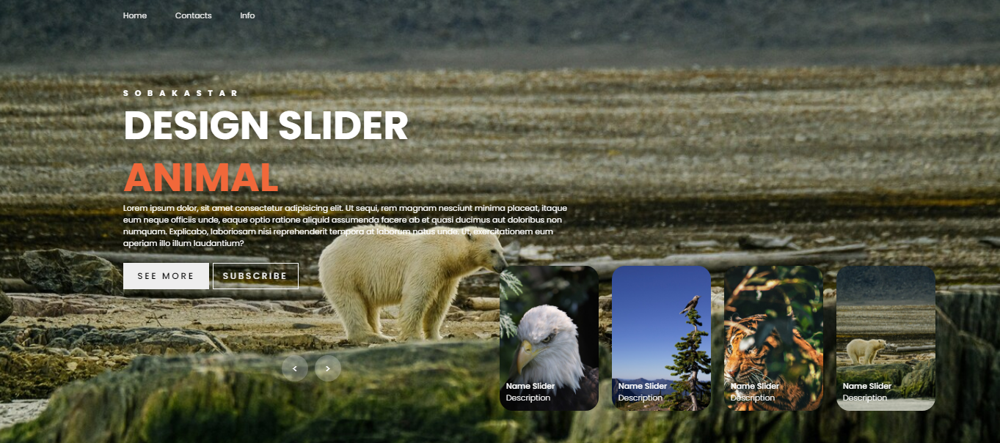

# Слайдер с различными эффектами и использованием HTML, CSS, JS.

## Слайдер с  использованием HTML, CSS и Javascript, с самыми выдающимися и полными функциями: Позволяет манипулировать навигационными кнопками для изменения отображаемого изображения, горизонтальную полосу, используемую для обратного отсчета времени работы слайдера. Анимация, создающая бесконечный цикл, помогает пользователям нажимать "Далее" вечно, но слайдеры никогда не кончатся, и автоматически переключать слайдер по истечении заданного времени.  Дизайн  был сделан адаптивным, поэтому он хорошо работает на разных экранах.

==========================

# Slider with various effects and using HTML, CSS, JS.

## Slider using HTML, CSS and Javascript, with the most outstanding and complete features: Allows you to manipulate the navigation buttons to change the displayed image, the horizontal bar used to count down the time of the slider. The animation, which creates an endless loop, helps users to click "Next" forever, but the sliders will never run out, and automatically switch the slider after a set time. The design has been made adaptive, so it works well on different screens.

